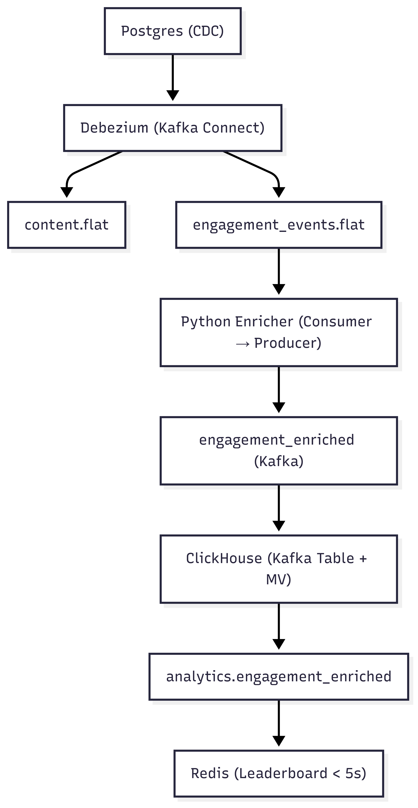

# 📊 تكليف مهندس برمجيات أول - ثمانية

مرحبًا! في هذا الدليل أشارك معكم حل تكليف مهندس برمجيات أول في بناء خط أنابيب تحليلات لحظية متكامل باستخدام:
**Docker + Kafka + Debezium + Python + ClickHouse + Redis (+ Streamlit Dashboard)**

---

## 📸 لقطات شاشة و فيديو توضيحي

فيما يلي بعض اللقطات والشروحات المرئية التي توضح عمل النظام:

### Screenshot Examples


### Demo Video
[🎬 شاهد الفيديو التوضيحي](media/Screencast%20from%2008-27-2025%2006:05:10%20PM.webm)

---

## نظرة عامة على النظام

هكذا صممت تدفق البيانات عندي:

```
Postgres (جداول المصدر مع CDC)
└─ Debezium (Kafka Connect)
├─ content.flat
└─ engagement_events.flat
└─ Python enricher (مستهلك ← منتج)
└─ engagement_enriched (Kafka)
└─ ClickHouse (جدول Kafka + MV)
└─ analytics.engagement_enriched (الجدول النهائي)
└─ Redis (لوحة تفاعلية لحظية < 5 ثوانٍ)
```



---

## 0. المتطلبات المسبقة

قبل أن تبدأ، تأكد أنك:
- ثبت **Docker & Docker Compose**
- لديك Python 3.9+ على جهازك
- كل ملفات المشروع موجودة عندك

---

## 1. تشغيل بيئة Docker

أنا أبدأ الخدمات بهذه الأوامر:

```bash
docker compose down -v
docker compose up -d
docker compose ps
```

وأنتظر حتى تعمل جميع الخدمات.

---

## 2. إعداد Postgres

إنشاء الجداول والأدوار والنشر (CDC):

```bash
docker exec -it pg psql -U app -d appdb <<'SQL'
CREATE EXTENSION IF NOT EXISTS pgcrypto;

DO $$
BEGIN
  IF NOT EXISTS (SELECT 1 FROM pg_roles WHERE rolname = 'dbz') THEN
    CREATE ROLE dbz WITH LOGIN PASSWORD 'dbz' REPLICATION;
  END IF;
END$$;

CREATE TABLE IF NOT EXISTS content (
    id              UUID PRIMARY KEY,
    slug            TEXT UNIQUE NOT NULL,
    title           TEXT        NOT NULL,
    content_type    TEXT CHECK (content_type IN ('podcast', 'newsletter', 'video')),
    length_seconds  INTEGER,
    publish_ts      TIMESTAMPTZ NOT NULL
);

CREATE TABLE IF NOT EXISTS engagement_events (
    id           BIGSERIAL PRIMARY KEY,
    content_id   UUID REFERENCES content(id),
    user_id      UUID,
    event_type   TEXT CHECK (event_type IN ('play', 'pause', 'finish', 'click')),
    event_ts     TIMESTAMPTZ NOT NULL,
    duration_ms  INTEGER,
    device       TEXT,
    raw_payload  JSONB
);

GRANT USAGE ON SCHEMA public TO dbz;
GRANT SELECT ON ALL TABLES IN SCHEMA public TO dbz;
ALTER DEFAULT PRIVILEGES IN SCHEMA public GRANT SELECT ON TABLES TO dbz;

DROP PUBLICATION IF EXISTS dbz_publication;
CREATE PUBLICATION dbz_publication
  FOR TABLE public.content, public.engagement_events;
SQL
```

---

## 3. إنشاء الموصل Debezium

* أنشئ ملف `connector.json` يحول البيانات إلى مواضيع مسطحة (`.flat`)
* سجل الموصل عبر REST API لـ Kafka Connect على المنفذ `8083`
* تحقق من المواضيع الجديدة باستخدام Kafka UI على `http://localhost:8080`

---

## 4. إدخال بيانات تجريبية

* أدخل بيانات في جدول `content` و `engagement_events`
* تحقق أن المواضيع `content.flat` و `engagement_events.flat` تستقبل أحداثًا جديدة

---

## 5. تشغيل Python Enricher

تثبيت المكتبات:

```bash
pip install kafka-python psycopg2
```

تشغيل السكربت:

```bash
python3 enrich_consumer.py
```

سيقوم هذا السكربت باستهلاك الأحداث من Kafka، إثرائها، ثم نشرها في موضوع جديد `engagement_enriched`.

---

## 6. ClickHouse: الإدخال والاستعلام

### إنشاء الجداول:

```sql
-- جدول Kafka المصدر
CREATE TABLE IF NOT EXISTS engagement_enriched_kafka
(
    content_id         String,
    user_id            String,
    event_type         String,
    event_ts           String,
    duration_ms        Nullable(Int32),
    content_type       Nullable(String),
    length_seconds     Nullable(Int32),
    engagement_seconds Nullable(String),
    engagement_pct     Nullable(String)
)
ENGINE = Kafka
SETTINGS
    kafka_broker_list = 'kafka:9092',
    kafka_topic_list = 'engagement_enriched',
    kafka_group_name = 'ch-sink-v6',
    kafka_format = 'JSONEachRow',
    kafka_num_consumers = 1,
    kafka_handle_error_mode = 'stream',
    input_format_json_read_numbers_as_strings = 0,
    input_format_json_try_infer_numbers_from_strings = 1;

-- الجدول النهائي
CREATE TABLE IF NOT EXISTS engagement_enriched
(
    content_id         String,
    user_id            String,
    event_type         String,
    event_ts           DateTime64(3, 'UTC'),
    duration_ms        Nullable(Int32),
    content_type       Nullable(String),
    length_seconds     Nullable(Int32),
    engagement_seconds Nullable(Decimal(18, 2)),
    engagement_pct     Nullable(Decimal(18, 2))
)
ENGINE = MergeTree
ORDER BY (content_id, event_ts);

-- العرض المادي (Materialized View) مع معالجة Null
DROP VIEW IF EXISTS mv_engagement_enriched;

CREATE MATERIALIZED VIEW mv_engagement_enriched
TO engagement_enriched AS
SELECT
    content_id,
    user_id,
    event_type,
    toTimeZone(parsed_ts, 'UTC') AS event_ts,
    duration_ms,
    content_type,
    length_seconds,
    toDecimal64OrNull(engagement_seconds, 2) AS engagement_seconds,
    toDecimal64OrNull(engagement_pct, 2)     AS engagement_pct
FROM
(
    SELECT
        content_id,
        user_id,
        event_type,
        parseDateTime64BestEffortOrNull(replaceRegexpAll(event_ts, 'Z$', ''), 3) AS parsed_ts,
        duration_ms,
        content_type,
        length_seconds,
        engagement_seconds,
        engagement_pct
    FROM engagement_enriched_kafka
)
WHERE parsed_ts IS NOT NULL;
```

### التحقق من الإدخال:

```bash
curl -u ch:chpw 'http://localhost:8123/?query=SELECT%20count()%20FROM%20analytics.engagement_enriched'
curl -u ch:chpw 'http://localhost:8123/?query=SELECT%20*%20FROM%20analytics.engagement_enriched%20ORDER%20BY%20event_ts%20DESC%20LIMIT%205'
```

أو استخدم واجهة ClickHouse [http://localhost:8123](http://localhost:8123)

---

## 7. Redis: لوحة الصدارة اللحظية

تشغيل المستهلك:

```bash
python3 redis_leaderboard_consumer.py
```

التحقق من النتائج:

```bash
docker exec -it redis redis-cli \
  ZREVRANGE "zset:eng:minute:$(date -u +%Y%m%d%H%M)" 0 9 WITHSCORES
```

سيظهر لك أعلى 10 محتويات من حيث التفاعل في آخر دقيقة (يتم التحديث خلال أقل من 5 ثوانٍ).

---

## 8. Streamlit Dashboard (اختياري)

يمكنك عرض النتائج في واجهة رسومية تفاعلية.

### تثبيت المكتبات:

```bash
pip install streamlit clickhouse-connect redis pandas python-dateutil
```

### تشغيل اللوحة:

```bash
streamlit run streamlit-dashboard.py
```

### المميزات:

* عرض الأحداث الأخيرة من ClickHouse
* تفاعل المستخدم مع المحتويات خلال آخر 60 دقيقة
* لوحة صدارة لحظية من Redis
* رسوم بيانية وجداول تفاعلية

افتح [http://localhost:8501](http://localhost:8501) في المتصفح.

---

## 🛠️ استكشاف الأخطاء

* إذا كان عدد الصفوف في ClickHouse = **0**:

  * تأكد أنك أنشأت جدول Kafka بـ **اسم مجموعة جديد** (`kafka_group_name`)
  * أرسل رسالة جديدة إلى موضوع `engagement_enriched`
* استخدم Kafka UI لفحص المواضيع: [http://localhost:8080](http://localhost:8080)
* تحقق من Redis باستخدام:

  ```bash
  docker exec -it redis redis-cli KEYS "zset:eng:*"
  ```

---

✅ الآن لديك خط أنابيب تحليلات لحظية كامل:

* **Postgres CDC**
* **Kafka + Debezium**
* **Python Enricher**
* **ClickHouse (مستودع بيانات)**
* **Redis (لوحة صدارة لحظية)**
* **Streamlit Dashboard (اختياري)**

---

##  الخطوات القادمة

خطوتي القادمة هي تطوير النظام ليتمكن من إرسال الرسائل إلى أنظمة أخرى. سأقوم ببناء خدمة REST API تستطيع دفع (Push) أو بث الرسائل المثرية إلى مستهلكين خارجيين أو خدمات مصغرة أو لوحات تحكم في الوقت الحقيقي. هذا سيجعل التكامل مع منصات أخرى أسهل بكثير ويفتح آفاقًا جديدة للتحليلات والأتمتة.


